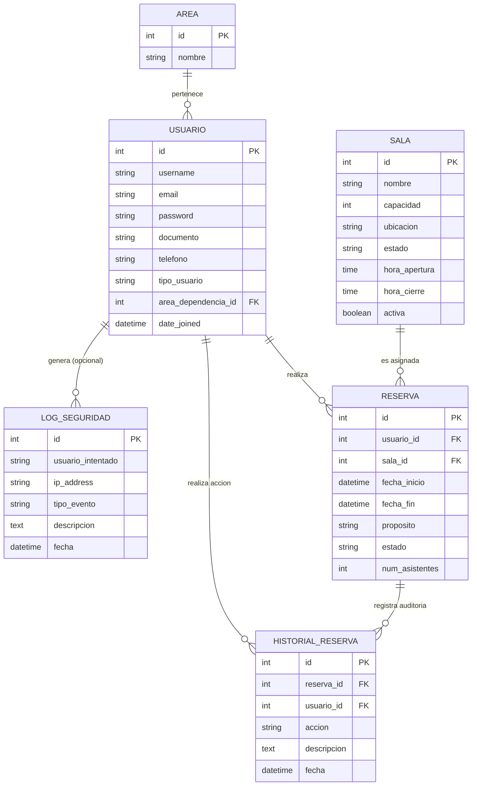

# 📊 Diccionario de Datos y Modelo Entidad-Relación (ISO/IEC 25000)
## Proyecto: Sistema de Agendamiento de Salas de Juntas - SENA v1.1.0

Este documento proporciona una descripción técnica exhaustiva de la base de datos MySQL utilizada por el sistema, garantizando la **Integridad** y **Adecuación Funcional** del software.

---

## 1. Modelo Entidad-Relación (DER)

---

## 2. Diccionario de Datos Detallado

### 2.1 Tabla: `usuarios_area` (Áreas/Dependencias)
| Campo | Tipo | Nulo | Llave | Descripción |
| :--- | :--- | :--- | :--- | :--- |
| `id` | INT | No | PK | Identificador único incremental. |
| `nombre` | VARCHAR(100) | No | Unique | Nombre de la dependencia técnica del SENA. |

### 2.2 Tabla: `usuarios_usuario` (Usuarios Personalizados)
| Campo | Tipo | Nulo | Llave | Descripción |
| :--- | :--- | :--- | :--- | :--- |
| `id` | INT | No | PK | Identificador único incremental. |
| `username` | VARCHAR(150) | No | Unique | Nombre de usuario para ingreso. |
| `email` | VARCHAR(254) | No | - | Correo electrónico institucional. |
| `documento` | VARCHAR(20) | No | Unique | Documento de identidad (Cédula/Tarjeta). |
| `tipo_usuario` | VARCHAR(20) | No | - | Rol: SUPERUSUARIO, OPERATIVO, CONSULTA. |
| `area_dependencia_id`| INT | Sí | FK | Vincula al usuario con un área específica. |
| `is_active` | BOOLEAN | No | - | Estado de habilitación en el sistema. |

### 2.3 Tabla: `salas_sala` (Salas de Juntas)
| Campo | Tipo | Nulo | Llave | Descripción |
| :--- | :--- | :--- | :--- | :--- |
| `id` | INT | No | PK | Identificador único de la sala. |
| `nombre` | VARCHAR(100) | No | Unique | Nombre descriptivo de la sala. |
| `capacidad` | INT UNSIGNED | No | - | Aforo máximo de personas permitido. |
| `ubicacion` | VARCHAR(150) | No | - | Especificación física (Ej: Edificio B). |
| `estado` | VARCHAR(20) | No | - | DISPONIBLE, MANTENIMIENTO, etc. |
| `hora_apertura` | TIME | No | - | Inicio de disponibilidad diaria. |
| `hora_cierre` | TIME | No | - | Fin de disponibilidad diaria. |

### 2.4 Tabla: `reservas_reserva` (Agendamientos)
| Campo | Tipo | Nulo | Llave | Descripción |
| :--- | :--- | :--- | :--- | :--- |
| `id` | INT | No | PK | Número de reserva único. |
| `usuario_id` | INT | No | FK | Usuario que posee la reserva. |
| `sala_id` | INT | No | FK | Sala reservada para el evento. |
| `fecha_inicio` | DATETIME | No | - | Comienzo exacto de la reunión. |
| `fecha_fin` | DATETIME | No | - | Finalización exacta de la reunión. |
| `estado` | VARCHAR(15) | No | - | CONFIRMADA, PENDIENTE, CANCELADA. |
| `num_asistentes` | INT UNSIGNED | No | - | Cantidad de personas que asistirán. |

### 2.5 Tabla: `reservas_historialreserva` (Auditoría)
| Campo | Tipo | Nulo | Llave | Descripción |
| :--- | :--- | :--- | :--- | :--- |
| `id` | INT | No | PK | ID de auditoría. |
| `reserva_id` | INT | No | FK | Reserva que sufrió el cambio. |
| `usuario_id` | INT | Sí | FK | Usuario que ejecutó la acción. |
| `accion` | VARCHAR(15) | No | - | CREADA, MODIFICADA, CANCELADA. |
| `fecha` | DATETIME | No | - | Marca de tiempo del evento. |

---
## 3. Atributos de Calidad (ISO 25000) en Datos
*   **Integridad**: Uso de llaves foráneas y restricciones `Unique` para prevenir duplicados.
*   **Eficiencia**: Índices implementados en `fecha_inicio` y `sala` para búsquedas rápidas en el calendario.
*   **Seguridad**: Separación de logs de acceso (`LogSeguridad`) de la lógica de negocio.

---
**Documento Generado el**: 24 de Febrero de 2026
**Responsable de Datos**: Antigravity AI
