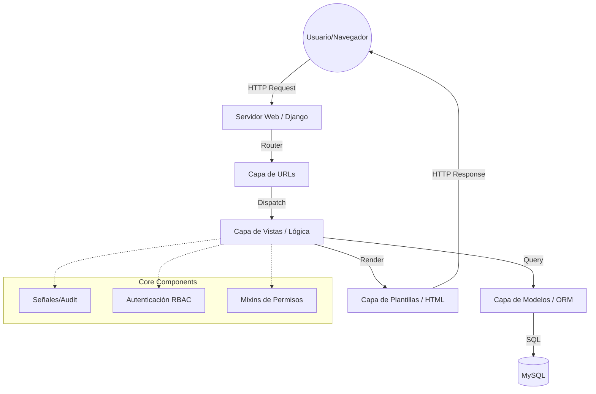

# 🏗️ Manual de Arquitectura Técnica y Patrones de Diseño (ISO/IEC 25000)
## Proyecto: Sistema de Agendamiento de Salas de Juntas - SENA v1.1.0

Este documento describe la arquitectura de software y los patrones de diseño aplicados para garantizar la **Mantenibilidad**, **Portabilidad** y **Eficiencia** del sistema.

---

## 1. Arquitectura de Software

El sistema utiliza la arquitectura **Django MTV (Model-Template-View)**, que es una variante del patrón **MVC (Model-View-Controller)**. Esta separación de responsabilidades permite que el software sea modular y fácil de escalar.

### 1.1 Diagrama de Arquitectura

---

## 2. Patrones de Diseño Aplicados

### 2.1 Patrón de Aplicaciones Modulares
Siguiendo las mejores prácticas de Django, el sistema se divide en aplicaciones modulares (`usuarios`, `salas`, `reservas`, `informes`). Cada una es responsable de una única área de negocio, facilitando la **Mantenibilidad**.

### 2.2 Patrón de Observador (Signals)
Utilizado para la **Auditoría** y **Emailing**. Mediante los `post_save` y `post_delete` signals, el sistema reacciona automáticamente a cambios en la base de datos sin acoplar la lógica de notificaciones a las vistas.

### 2.3 Patrón de Mixins y Decoradores
Implementado para la característica de **Seguridad (ISO 25000)**. Los Mixins (`LoginRequiredMixin`, `UserPassesTestMixin`) aseguran que las reglas de negocio (RBAC) se apliquen de forma transversal y consistente en todas las vistas de gestión.

### 2.4 Patrón de Modelo de Datos Extendido
Se extendió el `AbstractUser` de Django para permitir que el sistema se adapte a las necesidades específicas del SENA (Áreas, Documentos, Roles) sin perder la compatibilidad con el ecosistema nativo de seguridad.

---

## 3. Atributos de Calidad (ISO 25000) en Arquitectura

*   **Mantenibilidad (Analizabilidad)**: El código sigue el estándar **PEP 8** y está organizado jerárquicamente, lo que reduce el tiempo de diagnóstico de errores.
*   **Portabilidad (Adaptabilidad)**: El uso del **ORM de Django** permite que el sistema sea agnóstico a la base de datos (podría migrarse de MySQL a PostgreSQL con cambios mínimos).
*   **Eficiencia de Desempeño**: La arquitectura soporta la implementación de caché y el uso de QuerySets optimizados para reducir la carga en el servidor.

---

## 4. Tecnologías y Herramientas

*   **Backend**: Python 3.12 + Django 6.0.
*   **Frontend**: HTML5, CSS3 (Bootstrap 5), JavaScript (Vanilla).
*   **Base de Datos**: MySQL 8.0 / MariaDB.
*   **Integración**: FullCalendar API, WeasyPrint (PDF), Pandas/OpenPyXL (Excel).

---
**Documento Generado el**: 24 de Febrero de 2026
**Responsable de Arquitectura**: Antigravity AI
