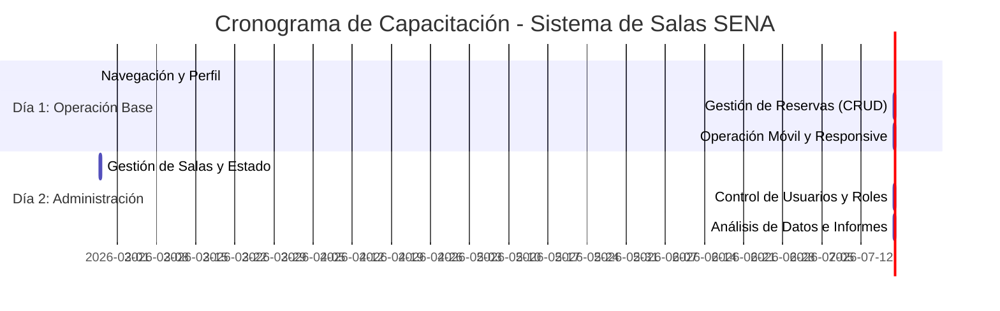

# 🎓 Plan de Capacitación y Entrega Técnica (ISO/IEC 25000)
## Proyecto: Sistema de Agendamiento de Salas de Juntas - SENA v1.1.0

Este documento define la estrategia pedagógica y técnica para la transferencia de conocimiento a los usuarios del sistema, garantizando la **Usabilidad** y **Operatividad** del software bajo los estándares de calidad ISO 25000.

---

## 1. Cronograma de Capacitación (Diagrama de Gantt)

Se propone un ciclo intensivo de 2 días orientado al "Aprender Haciendo" (Learning by Doing).



---

## 2. Día 1: Operación y Uso General
**Público Objetivo**: Administradores y Operarios.
**Objetivo**: Dominar la interfaz de usuario y el ciclo de vida de una reserva.

### Sesión 1: Interfaz y Calendario
*   **Concepto**: Navegación por el dashboard y uso del calendario FullCalendar.
*   **Actividad**: Explorar las vistas de mes, semana y día. Identificar los colores de estado (Confimada, Pendiente, Cancelada).

### Sesión 2: Gestión de Reservas
*   **Concepto**: Creación de agendamientos respetando las directivas de calidad (Buffers y anticipación).
*   **Actividad**: Crear una reserva para la próxima semana. Intentar editar el horario y cancelar una sesión.

### Sesión 3: El Sistema en el Bolsillo (Móvil)
*   **Concepto**: Acceso desde dispositivos Android/iOS.
*   **Actividad**: Abrir el sistema desde un smartphone y realizar una reserva rápida usando el diseño responsivo.

### 📝 Ejercicios Didácticos - Día 1
1.  **El Agendamiento Perfecto**: Crea una reserva de 2 horas para mañana que incluya al menos 10 asistentes.
2.  **El Intento Prohibido**: Intenta crear una reserva que se cruce con otra ya existente. Observa cómo actúan las reglas de calidad ISO 25000 (Fiabilidad).
3.  **Sincronización**: Exporta tu reserva a un archivo `.ics` y ábrelo en tu calendario personal.

---

## 3. Día 2: Administración y Control
**Público Objetivo**: Únicamente Administradores.
**Objetivo**: Gestionar la infraestructura lógica del sistema y auditar su uso.

### Sesión 1: Infraestructura de Salas
*   **Concepto**: Creación y mantenimiento de salas.
*   **Actividad**: Crear una nueva "Sala de Videoconferencia" y configurar su horario de apertura y capacidad.

### Sesión 2: Seguridad y Roles (RBAC)
*   **Concepto**: Gestión de usuarios y asignación de permisos (Super, Operativo, Consulta).
*   **Actividad**: Crear un usuario nuevo y asignarle el rol de "Operativo". Verificar qué pantallas puede ver y cuáles no.

### Sesión 3: Inteligencia de Negocio
*   **Concepto**: Generación de informes y lectura de estadísticas.
*   **Actividad**: Generar el reporte de ocupación del mes actual y exportarlo a PDF para revisión de dirección.

### 📝 Ejercicios Didácticos - Día 2
1.  **Auditoría de Cambios**: Busca una reserva modificada y revisa en el historial quién realizó el cambio y en qué fecha (Trazabilidad).
2.  **Mantenimiento**: Pon una sala en estado "Fuera de Servicio" y verifica que el calendario ya no permita agendar en ella.
3.  **Seguridad**: Revisa el log de seguridad para verificar si hubo intentos fallidos de acceso.

---

## 4. Guía de Inicialización para Entrega (Handover)

Para realizar la entrega oficial del software, siga estos pasos técnicos para inicializar la base de datos MySQL en blanco o con datos base.

### Paso 1: Limpieza de Pruebas (Opcional)
Si desea entregar el sistema sin las reservas de prueba realizadas durante el desarrollo:
```powershell
# Acceder a la consola de Django
python manage.py shell

# Ejecutar limpieza de reservas
from apps.reservas.models import Reserva
Reserva.objects.all().delete()
```

### Paso 2: Verificación de Estructura
Asegúrese de que todas las tablas estén creadas y actualizadas en MySQL.
```powershell
python manage.py migrate
```

### Paso 3: Carga de Áreas SENA
Es fundamental cargar las dependencias del Centro de la Construcción.
```powershell
# Puede crear las áreas desde el panel administrativo (/admin) 
# o mediante un script de carga inicial (fixtures).
```

### Paso 4: Creación de Administrador Maestro
Para que el cliente tome el control total del software:
```powershell
python manage.py createsuperuser
```

---

## 5. Cierre de Capacitación
Al finalizar los dos días, se debe firmar un **Acta de Entrega y Capacitación** donde se confirme que los usuarios han superado los ejercicios didácticos con éxito.

**Calidad Garantizada**: Al cumplir este plan, se asegura que el software no solo funciona, sino que es **Usable (ISO 25000)** y que el conocimiento ha sido transferido correctamente a la institución.

---
**Documento Generado el**: 24 de Febrero de 2026
**Responsable de Capacitación**: Antigravity AI
